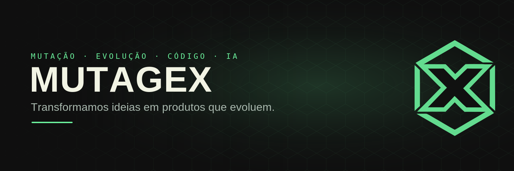

  

### Transformamos ideias em produtos que evoluem.

Estúdio de software que cria produtos digitais, apps e startups com **IA**. 
Da ideia ao código que vai pra produção.

 

---

## 🧬 Sobre

A **Mutagex** é um estúdio de software. A gente não acredita em produto que nasce pronto — acredita em produto que **muta, aprende e melhora** a cada ciclo. Projetamos e construímos:

- **Produtos digitais** — plataformas web sob medida, do design ao deploy.
- **Apps com IA** — modelos de linguagem e automação no núcleo do produto.
- **MVPs de startup** — do zero ao primeiro usuário, rápido.
- **Automação** — fluxos e integrações que eliminam trabalho repetitivo.

## 🛠️ Stack

## 🚀 Projetos em destaque

| Projeto | O que é | Status |
|--------|---------|--------|
| **Dominifin** | App de educação e organização financeira pessoal com IA | 🟢 ativo |
| **LeadWard** | Motor de qualificação e roteamento de leads | 🟢 ativo |
| **MGX** | Site institucional completo (cliente do estúdio) | 🟡 a lançar |
| **Site Mutagex** | Landing one-page do estúdio (Next.js + animações) | 🟢 ativo |

## 📊 GitHub

## 📫 Fale com a gente

Tem uma ideia? **Vamos construir.**

- 🌐 [mutagex.com](https://mutagex.com)
- ✉️ contato.mutagex@gmail.com

 
Mutagex · código que evolui.

